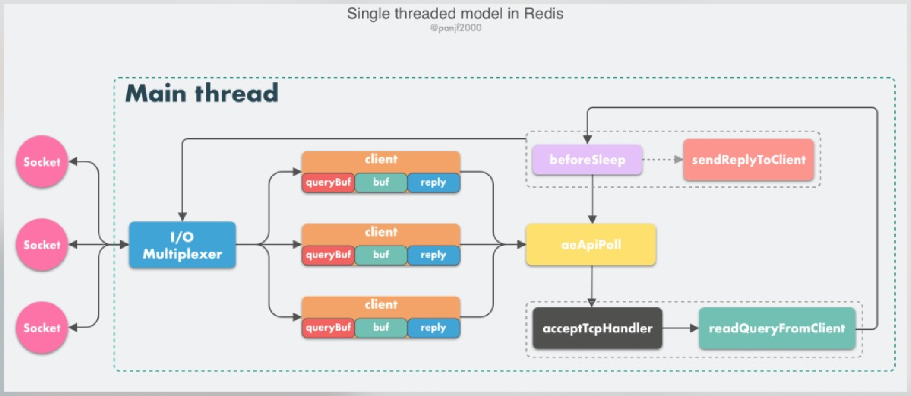

from [腾讯技术工程-2021/3/3](https://mp.weixin.qq.com/s/-op5WR1wSkgAuP7JYZWP8g)

[TOC]

### Intro

- 在目前的技术选型中：Redis 已成为系统高性能缓存方案的事实标准 **-->** 因此 Redis 成为后端开发的基本技能之一 **-->** 因此 Redis 的底层原理成为必学的知识
- Redis 本质上来讲是一个网络服务器

### Redis 有多快

普通硬件配置的 Linux 机器上，单个 Redis 实例

- QPS可以达到 8w+；

- 如果使用 pipeline 批处理功能，QPS 可以达到100w

### Redis 为什么快？

- **C language**
- **In-memory**： 纯内存I/O
- **I/O multiplexing**：I/O多路复用，基于 epoll/select/kqueue等IO多路复用技术，实现高吞吐的网络I/O
- **single threaded**：单线程模型避免了多线程频繁上下文切换，以及同步机制如锁带来的开销

### Redis 为何选择单线程?

1. 对于一个DB来说，CPU通常不会是瓶颈，因为大多数请求不是CPU密集型的，而是IO密集型
2. 如果不考虑 RDB/AOF 等持久化方案， Redis 是完全的纯内存操作，执行速度是非常快的，因此这部分操作通常不会是性能瓶颈。
3. Redis的真正性能瓶颈在于网络I/O，也就是客户端和服务端之间的网络传输延迟

具体来说:

1. 避免过多的上下文切换开销
2. 避免同步机制的开销：如锁
3. 简单可维护：引入多线程必然会导致代码的复杂度上升和可维护性下降

### Redis 真的是单线程吗？

- Redis v4.0 (引入多线程处理异步任务)
- Redis v6.0 (正式在网络模型中实现I/O多线程)

单线程事件循环

- 从v1.0到v6.0，Redis 的核心网络模型一直是一个典型的 Reactor 模型；利用 epoll/select/kqueue 等多路复用技术，在单线程的事件循环中不断去处理事件(客户端请求)，最后回写响应数据到客户端

- client: 客户端对象，Redis使用结构体client存储客户端的所有相关信息，包括但不限于
  - 封装的套接字连接 -- *conn
  - 当前选择的数据库指针 -- *db
  - 读入缓冲区 -- querybuf
  - 写出缓冲区 -- buf
  - 写出数据链表 -- reply
- aeApiPoll：I/O多路复用API
- acceptTcpHandler

### Redis 多线程网络模型