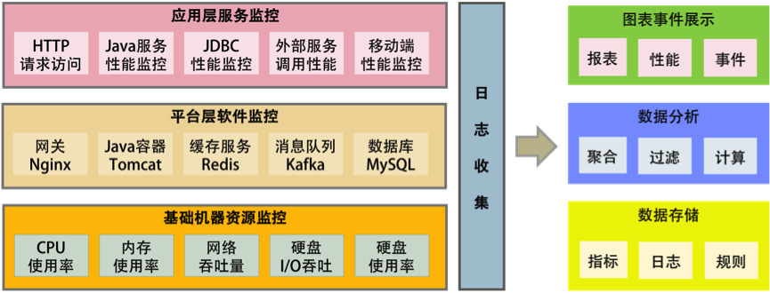
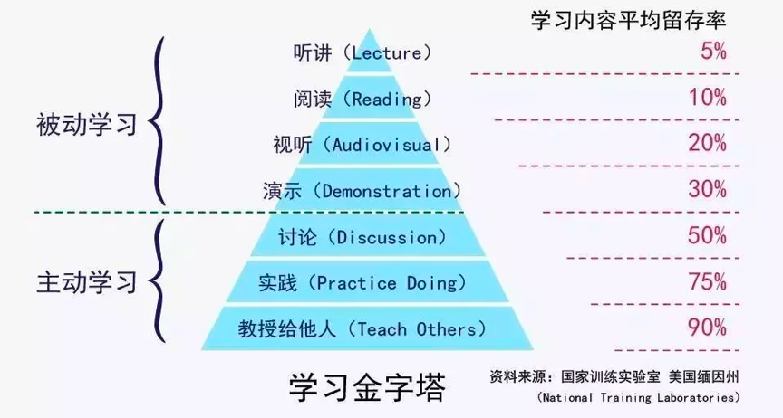

[toc]


### 08 | Go语言, Docker和新技术


- Go 语言和 Docker 这两种技术已经成为新一代的云计算技术
- Go 语言的 Goroutine 和 Channel 这两个神器简直就是**并发**和**异步编程**的福音。
- Go 语言所吞食的项目应该主要是**中间层**的项目，既不是非常底层也不会是业务层。
  - Go 语言能吞食的一定是 PaaS 上的项目，比如一些消息缓存中间件、服务发现、服务代理、控制系统、Agent、日志收集等等，
  - 他们没有复杂的业务场景，也到不了特别底层（如操作系统）的软件项目或工具。
- 关于 Docker 我还想多说几句，这是云计算中 **PaaS** 的关键技术。PaaS 层是承上启下的关键技术，**任何一个不重视 PaaS 的公司，其技术架构都不可能让这家公司成长为一个大型的公司**。因为 PaaS 层的技术主要能解决下面这些问题。


## 分布式架构

### 21 | 分布式系统架构的冰与火


#### 分布式系统的优缺点：

优点：大流量处理+关键业务保护

- **增大系统容量**：业务量变大 -> 需要多台机器应对大规模的应用场景 -> 需要垂直或是水平拆分业务系统，让其变成一个分布式的架构。
- **加强系统可用**：关键的业务，对系统架构的可用性要求很高，不能存在单点故障  -> 需要通过分布式架构的冗余系统来消除单点故障

缺点：

- 分布式系统架构的难点在于**系统设计**，以及**管理和运维**。所以，分布式架构解决了“单点”和“性能容量”的问题，但却新增了一堆问题。


#### 分布式系统的发展：

- 模块化编程(20世纪70年代) -> 面向事件设计(80年代) -> 基于接口/构件设计(90年代) -> SOA：**基于服务的架构**

- 基于服务架构的三个阶段：
  - 90年代前，单体架构，软件模块高度耦合
  - 2000年，比较松耦合的SOA架构，需要一个标准的协议或是中间件来联动其它相关联的服务(如ESB)。这样一来，**服务间并不直接依赖，而是通过中间件的标准协议或是通讯框架相互依赖**。这其实就是 IoC（控制反转）和 DIP（依赖倒置原则）设计思想在架构中的实践。它们都依赖于一个**标准的协议**或是一个**标准统一的交互方式**，而不是直接调用。
  - 而 2010 年后，出现了**微服务架构**，这个架构更为松耦合。**每一个微服务都能独立完整地运行（所谓的自包含）**，后端单体的数据库也被微服务这样的架构分散到不同的服务中。而它和传统 SOA 的差别在于，**服务间的整合需要一个服务编排或是服务整合的引擎**。就好像交响乐中需要有一个指挥来把所有乐器编排和组织在一起。
    - 一般来说，这个编排和组织引擎可以是**工作流引擎**，也可以是**网关**。当然，还需要辅助于像**容器化调度**这样的技术方式，如 **Kubernetes**。在 Martin Fowler 的 [Microservices](https://martinfowler.com/articles/microservices.html) 这篇文章中有详细描述。
    - 微服务的出现使得开发速度变得更快，部署快，隔离性高，系统的扩展度也很好，但是在**集成测试**、**运维**和服务管理等方面就比较麻烦了。所以，需要一套比较好的**微服务 PaaS 平台**。就像 Spring Cloud 一样需要**提供各种配置服务**、**服务发现**、**智能路由**、**控制总线**……还有像 Kubernetes 提供的各式各样的**部署和调度方式**。


### 22 | 从亚马逊的实践，谈分布式系统的难点


#### 分布式需要注意的问题

问题1：异构系统的不标准问题

问题2：系统架构中的服务依赖性问题

1. 非关键业务被关键业务所依赖，会导致非关键业务变成一个关键业务
2. 数据库方面也要做相应的隔离，服务间不能读取对方的数据库，只通过服务接口耦合

问题3：故障发生的概率更大

1. 需要我们在设计或运维系统时要为故障考虑：Design for Failure
2. 在设计时就要考虑如何减轻故障，如果无法避免，也要使用自动化的方式恢复故障，减少故障影响面

问题4：多层架构的运维复杂度更大

- 通常，系统可分为四层：基础层、平台层、应用层、接入层
  - 基础层就是我们的机器、网络和存储设备等。
  - 平台层就是我们的中间件层，Tomcat、MySQL、Redis、Kafka 之类的软件。
  - 应用层就是我们的业务软件，比如，各种功能的服务。
  - 接入层就是接入用户请求的网关、负载均衡或是 CDN、DNS 这样的东西。
- 任何一层的问题都会导致整体的问题；没有统一的视图和管理，导致运维被割裂开来，造成更大的复杂度。


### 23 | 分布式系统的技术栈


#### 提高架构的性能

- **缓存系统**：
  - 加入缓存系统，可以有效地提高系统的访问能力。从前端的浏览器，到网络，再到后端的服务，底层的数据库、文件系统、硬盘和 CPU，全都有缓存，**这是提高快速访问能力最有效的手段**。
  - 对于分布式系统下的缓存系统，需要的是一个**缓存集群**。这其中需要一个 **Proxy** 来做**缓存的分片**和**路由**。
- **负载均衡系统**。
  - 负载均衡系统是**水平扩展**的关键技术，它可以使用多台机器来共同分担一部分流量请求。
- **异步调用**。
  - 异步系统主要通过**消息队列**来对请求做**排队处理**，这样可以把前端的请求的峰值给“削平”了，而后端通过自己能够处理的速度来处理请求。
  - 这样可以**增加系统的吞吐量**，但是实时性就差很多了。
  - 同时，还会引入消息丢失的问题，所以要对消息做**持久化**，这**会造成“有状态”的结点**，从而增加了服务调度的难度。
- **数据分区和数据镜像**。
  - 数据分区是把数据按一定的方式分成多个区（比如通过地理位置），不同的数据区来分担不同区的流量。
  - 这需要一个**数据路由**的中间件，会导致跨库的 Join 和跨库的事务非常复杂。
  - 而数据镜像是把一个数据库镜像成多份一样的数据，这样就不需要数据路由的中间件了。你可以在任意结点上进行读写，内部会自行同步数据。然而，**数据镜像中最大的问题就是数据的一致性问题。**
  - 对于一般公司来说，在初期，会使用**读写分离**的数据镜像方式，而后期会采用**分库分表**的方式。



#### 提高架构的稳定性

- **服务拆分**。
  - 服务拆分主要有两个目的：一是为了**隔离故障**，二是为了**重用服务模块**。
  - 但服务拆分完之后，会引入**服务调用间的依赖问题**。
- **服务冗余**。
  - 服务冗余是为了**去除单点故障**，并可以支持服务的**弹性伸缩**，以及**故障迁移**。
  - 然而，对于一些有状态的服务来说，冗余这些有状态的服务**带来了更高的复杂性**。其中一个是弹性伸缩时，需要考虑数据的复制或是重新分片，迁移的时候还要迁移数据到其它机器上。
- **限流降级**。
  - 当系统实在扛不住压力时，只能通过**限流**或者**功能降级**的方式来停掉一部分服务，或是**拒绝**一部分用户，以确保整个架构不会挂掉。这些技术属于保护措施。
- **高可用架构**。
  - 通常来说高可用架构是从**冗余架构**的角度来保障可用性。比如，**多租户隔离**，**灾备多活**，或是数据可以在其中复制保持一致性的集群。总之，就是为了不出单点故障。
- **高可用运维**。
  - 高可用运维指的是 DevOps 中的 CI/CD（持续集成 / 持续部署）。一个良好的运维应该是一条很流畅的软件发布管线，其中做了足够的自动化测试，还可以做相应的灰度发布，以及对线上系统的自动化控制。这样，可以做到“计划内”或是“非计划内”的宕机事件的时长最短。


#### 分布式系统的关键技术

- **服务治理**。服务拆分、服务调用、服务发现、服务依赖、服务的关键度定义……服务治理的最大意义是**需要把服务间的依赖关系、服务调用链，以及关键的服务给梳理出来**，并对这些服务进行性能和可用性方面的管理。
- **架构软件管理**。服务之间有依赖，而且有兼容性问题，所以，整体服务所形成的架构需要有架构版本管理、整体架构的生命周期管理，以及对服务的编排、聚合、事务处理等服务调度功能。
- **DevOps**。分布式系统可以更为快速地更新服务，但是对于服务的测试和部署都会是挑战。所以，还需要 DevOps 的全流程，其中包括**环境构建**、**持续集成**、**持续部署**等。
- **自动化运维**。有了 DevOps 后，我们就可以对服务进行**自动伸缩**、**故障迁移**、**配置管理**、**状态管理**等一系列的自动化运维技术了。
- **资源调度管理**。应用层的自动化运维需要基础层的调度支持，也就是云计算 IaaS 层的计算、存储、网络等资源调度、隔离和管理。
- **整体架构监控**。如果没有一个好的监控系统，那么自动化运维和资源调度管理只可能成为一个泡影，因为监控系统是你的眼睛。没有眼睛，没有数据，就无法进行高效的运维。所以说，监控是非常重要的部分。这里的监控需要对三层系统（应用层、中间件层、基础层）进行监控。
- **流量控制**。最后是我们的流量控制，负载均衡、服务路由、熔断、降级、限流等和流量相关的调度都会在这里，包括灰度发布之类的功能也在这里。


今天有一个技术叫——Docker，

- 通过 **Docker** 以及其衍生出来的 **Kubernetes** 之类的软件或解决方案，大大地降低了做上面很多事情的门槛。
- Docker 把软件和其运行的环境打成一个包，然后比较轻量级地启动和运行。在运行过程中，因为软件变成了服务可能会改变现有的环境。但是没关系，当你重新启动一个 Docker 的时候，环境又会变成初始化状态。


#### 分布式系统的”纲“

总结一下上面讲述的内容，你不难发现，分布式系统有五个关键技术，它们是：

- 全栈系统监控；
- 服务 / 资源调度；
- 流量调度；
- 状态 / 数据调度；
- 开发和运维的自动化。

而最后一项——开发和运维的自动化，是需要把前四项都做到了，才有可能实现的。所以，最为关键是下面这四项技术，即应用整体监控、资源和服务调度、状态和数据调度及流量调度，它们是构建分布式系统最最核心的东西。


### 24 | 分布式系统关键技术：全栈监控


#### 多层体系的监控

所谓全栈监控，其实就是三层监控。

- **基础层**：监控主机和底层资源。比如：CPU、内存、网络吞吐、硬盘 I/O、硬盘使用等。
- **中间层**：就是中间件层的监控。比如：Nginx、Redis、ActiveMQ、Kafka、MySQL、Tomcat 等。
- **应用层**：监控应用层的使用。比如：HTTP 访问的吞吐量、响应时间、返回码、调用链路分析、性能瓶颈，还包括用户端的监控。



这还需要一些监控的标准化。

- 日志数据结构化；
- 监控数据格式标准化；
- 统一的监控平台；
- 统一的日志分析。


#### 什么是好的监控系统?

一个好的监控系统应该有以下几个特征。

- 关注于整体应用的 SLA。
- 关联指标聚合。
- 快速故障定位。


换句话说，一个好的监控系统主要是为以下两个场景所设计的。

“体检”

- **容量管理**。 提供一个全局的系统运行时数据的展示，可以让工程师团队知道是否需要增加机器或者其它资源。
- **性能管理**。可以通过查看大盘，找到系统瓶颈，并有针对性地优化系统和相应代码。

“急诊”

- **定位问题**。可以快速地暴露并找到问题的发生点，帮助技术人员诊断问题。
- **性能分析**。当出现非预期的流量提升时，可以快速地找到系统的瓶颈，并帮助开发人员深入代码。


#### 如何做出一个好的监控系统

- **服务调用链跟踪**。
- **服务调用时长分布**。
- **服务的 TOP N 视图**。
  - 所谓 TOP N 视图就是一个系统请求的排名情况。
  - 一般来说，这个排名会有三种排名的方法：a）按调用量排名，b) 按请求最耗时排名，c）按热点排名（一个时间段内的请求次数的响应时间和）。
- **数据库操作关联**。
- **服务资源跟踪**。

### 25 | 分布式系统关键技术：服务调度

#### 服务关键程度和服务的依赖关系

#### 服务状态和生命周期的管理

#### 整个架构的版本管理

#### 资源/服务调度

#### 服务状态的维持和拟合

#### 服务的弹性伸缩和故障迁移

#### 服务工作流和编排


### 26 | 分布式系统关键技术：流量与数据调度


### 27 | 洞悉PaaS平台的本质


#### 商业公司的软件工程能力

一家商业公司的软件工程能力主要体现在三个地方。

第一，提高服务的 SLA。

第二，能力和资源重用或复用。

第三，过程的自动化。

#### PaaS平台的本质

一个好的 PaaS 平台应该具有分布式、服务化、自动化部署、高可用、敏捷以及分层开放的特征，并可与 IaaS 实现良好的联动。


下面这三件事是 PaaS 跟传统中间件最大的差别。

- **服务化是 PaaS 的本质**。软件模块重用，服务治理，对外提供能力是 PaaS 的本质。
- **分布式是 PaaS 的根本特性**。多租户隔离、高可用、服务编排是 PaaS 的基本特性。
- **自动化是 PaaS 的灵魂**。自动化部署安装运维，自动化伸缩调度是 PaaS 的关键。

#### PaaS平台的总体架构


在 Docker+Kubernetes 层之上，我们看到了两个相关的 PaaS 层。

- 一个是 **PaaS 调度层**，很多人将其称为 iPaaS；另一个是 **PaaS 能力层**，通常被称为 aPaaS。
- 没有 PaaS 调度层，PaaS 能力层很难被管理和运维，
- 而没有 PaaS 能力层，PaaS 就失去了提供实际能力的业务价值。


总结一下，一个完整的 PaaS 平台会包括以下几部分。

- **PaaS 调度层** – 主要是 PaaS 的自动化和分布式对于高可用高性能的管理。
- **PaaS 能力服务层** – 主要是 PaaS 真正提供给用户的服务和能力。
- **PaaS 的流量调度** – 主要是与流量调度相关的东西，包括对高并发的管理。
- **PaaS 的运营管理** – 软件资源库、软件接入、认证和开放平台门户。
- **PaaS 的运维管理** – 主要是 DevOps 相关的东西。

### 28 | 推荐阅读：分布式系统架构经典资料


### 29 | 推荐阅读：分布式数据调度相关论文


## Go语言编程模式


### 107 | 切片、接口、时间和性能

#### Slice

```go
// 一、slice 结构体定义
type slice struct {
  array unsafe.Pointer  // 指向存放数据的数组指针
  len int
  cap int
}

// 二、结构体里用数组指针 —— 意味着数据会发生共享
a := make([]int, 5)
b := a[1:4]
b[1] = 100 // a 和 b 是内存共享的, 所以对 b 的修改会影响到 a

// 三、append()操作可能导致内存重新分配
a := make([]int, 32)
b := a[0:16]	    // 此时, a 和 b 的内存共享
a = append(a, 1)  // append()这个操作在cap不够用的时候, 会让a重新分配内存, 导致a和b不再共享
a[0] = 100	      // 赋值不再互相影响

// 四、深度比较 reflect.DeepEqual()
m1 := map[string]string{"one": "a","two": "b"} 
m2 := map[string]string{"two": "b", "one": "a"} 
fmt.Println("m1 == m2:",reflect.DeepEqual(m1, m2)) 
//prints: m1 == m2: true

```

#### 接口

在 Go 语言中，使用“成员函数”的方式叫“**Receiver**”，这种方式是一种**封装**，因为 PrintPerson()本来就是和 Person强耦合的，所以理应放在一起。更重要的是，这种方式可以进行**接口编程**，对于接口编程来说，也就是一种抽象，主要是用在“多态”

```go
// 方法一：使用函数
func PrintPerson(p *Person) {
    fmt.Printf("Name=%s, Sexual=%s, Age=%d\n", p.Name, p.Sexual, p.Age)
}

// 方法二：使用成员函数
func (p *Person) Print() {
    fmt.Printf("Name=%s, Sexual=%s, Age=%d\n", p.Name, p.Sexual, p.Age)
}

func main() {
    var p = Person{
        Name: "Hao Chen",
        Sexual: "Male",
        Age: 44,
    }

    PrintPerson(&p)
    p.Print()
}
```


下面 `Country` 和 `City` 实现了接口 `Printable` 的方法，代码是一样的，能不能省略掉？

```go
type Country struct {
    Name string
}

type City struct {
    Name string
}

// Printable 的接口
type Printable interface {
    PrintStr()
}

// Country 实现接口方法
func (c Country) PrintStr() {
    fmt.Println(c.Name)
}

// City 实现接口方法
func (c City) PrintStr() {
    fmt.Println(c.Name)
}

c1 := Country {"China"}
c2 := City {"Beijing"}
c1.PrintStr()
c2.PrintStr()
```

**接口完整性检查**


#### 时间

#### 性能提示

### 108 | 错误处理

#### Go语言的错误处理

- 函数支持多返回值，Go语言的错误处理的方式，本质上是返回值检查

#### 资源清理

- C语言：goto fail
- C++：RAII模式，通过面向对象的代理模式，把需要清理的资源交给一个代理类，然后再析构函数来解决
- Java语言：可以在 finally 语句块里进行清理
- Go语言：使用 `defer` 关键词进行清理

```go
func Close(c io.Closer) {
  err := c.Close()
  if err != nil {
    log.Fatal(err)
  }
}

func main() {
  r, err := Open("a")
  if err != nil {
    log.Fatalf("error opening 'a'\n")
  }
  defer Close(r) // 使用defer关键字在函数退出时关闭文件。

  r, err = Open("b")
  if err != nil {
    log.Fatalf("error opening 'b'\n")
  }
  defer Close(r) // 使用defer关键字在函数退出时关闭文件。
}
```

#### Error Check Hell

#### 包装错误


### 109 | Functional Options


### 110 | 委托和反转


### 111 | Map-Reduce


### 112 | Go Generation


### 113 | 修饰器


### 114 | Pipeline


### 115 | Kubernetes Visitor 模式


## 尾声

### 结束语 | 业精于勤，行成于思

#### 学习金字塔

- 被动学习和主动学习



#### ARTS

Algorithm + Review + Tip + Share，具体就是每周

- 1个Algorithm
- Review 一篇英文文章
- 总结一个工作中的技术 Tip
- Share 一个传递价值观的东西

