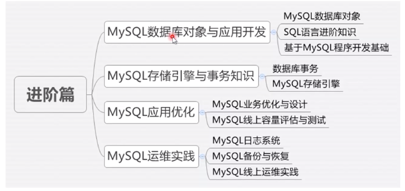
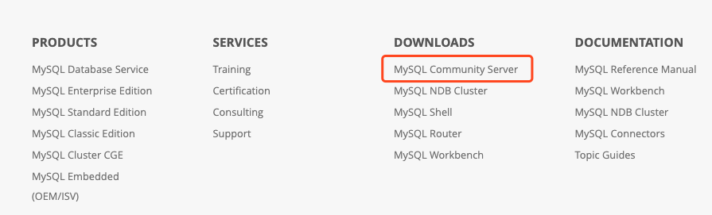
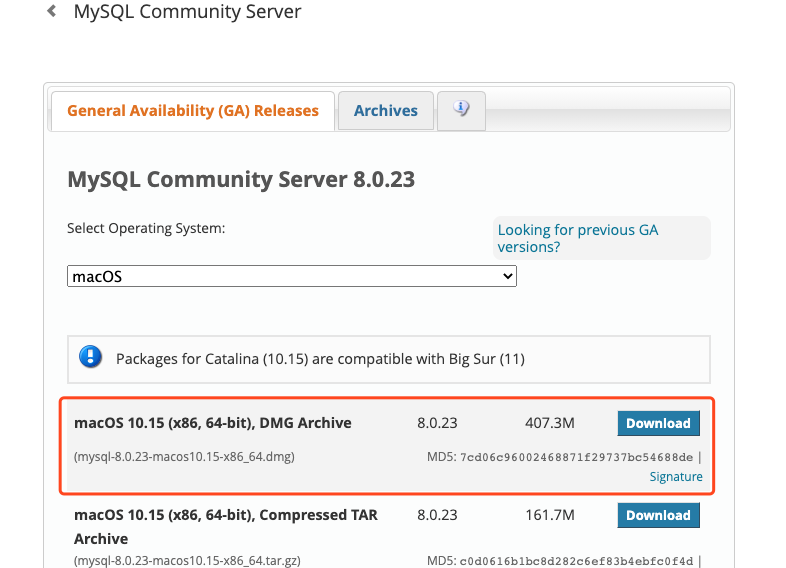
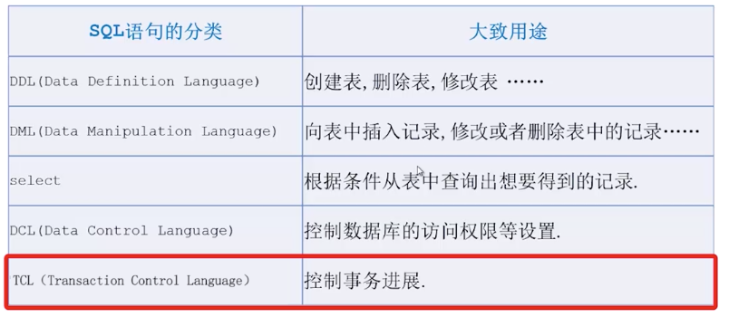
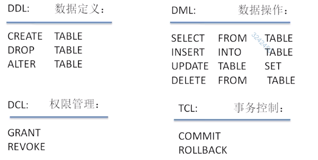

# MySQL数据库基础


## 1.认识MySQL (15min)


什么是数据库？


为什么要使用数据数据库？


数据库的分类：

- 关系型数据库

- 非关系型数据库

  

为什么学习MySQL?

- 最流行：
- 开源：前三强中唯一开源数据库；社区强大
- 并不是最先进


谁需要学习MySQL?

- 应用开发者：目标利用MySQL开发出性能优异的应用程序
  - 学习数据库类型的正确使用
  - 学习如何利用索引优化查询效率
  - 了解分区；读写分离等特性
  - 了解数据库事务相关特性
- DBA：目标是为企业提供可靠的数据库技术保障
  - 和开发者一样学习MySQL的使用技巧
  - 学习MySQL体系结构知识
  - 学习日常运维，性能调优，故障排查等知识
  - 学习数据层架构设计，schema优化知识


课程内容大纲简介

- 入门篇

  - 安装MySQL
  - SQL语言基础和简单操作

- 进阶篇

  

  

## 2. 安装 mysql


1） 进入官网 https://www.mysql.com/downloads/ , 选择底部的 MySQL Community Server



2）下载安装包




## 2.1 忘记Mysql密码怎么办？

https://blog.csdn.net/u013972652/article/details/87254950


- localhost: 123456
- mac_lyh:


## 3 连接使用mysql

1. 使用应用程序连接MySQL

- 应用程序使用驱动(connector/driver)客户端连接MySQL...
- MySQL驱动程序涵盖各种主流语言


2. 使用命令行连接Mysql

安装

1. 安装MySQL客户端软件包

2. 设置环境变量：`EXPORT PATH=$PATH:/usr/local/mysql/bin`
3. 验证命令行工具安装成功：`mysql -v`


连接

1. Socket连接 （本地连接）：需要指定socket文件和用户名密码

   - 查找socket文件：Mysql启动的时候默认生成在 `/tmp/mysql.sock`; 文件权限为 `777`, 不要去改
   - 也可以通过 `show global variables like 'socket'` 来确定

   - `mysql -S /tmp/mysql.sock -u root -p`

2. 本地连接2

   - `mysql -u root -p `

3. TCP/IP连接 (远程连接)：需要ip和端口(mysql默认端口是3306)

   - `mysql -h 127.0.0.1 -P 3306 -u root -p`


DBA常用命令

- `status`
- `show processlist`
- `help` / `help select`
- `show global variables like 'sock'`


常用的图形客户端工具

- `Navicat`
- `MySQLWorkBench`


## 4. SQL语言入门 (17min)


SQL: Structured Query Language


### SQL 语句分类







### DDL 数据定义

```sql
// 创建表
mysql> create table stu(
	id int(10),
	name varchar(20),
	age int(10),
	primary key(id));
	
mysql> show create table stu;
| Table | Create Table                                                                                                                                                              
| stu   | CREATE TABLE `stu` (
  `id` int(10) NOT NULL,
  `name` varchar(20) DEFAULT NULL,
  `age` int(10) DEFAULT NULL,
  PRIMARY KEY (`id`)
) ENGINE=InnoDB DEFAULT CHARSET=latin1

// 新增字段
mysql> alter table stu add column gender varchar(20);

// 修改表字段
mysql> alter table stu modify column gender varchar(40);

// 删除字段
mysql> alter table stu drop column gender

// 删除表: 除了表结构, 以及数据会随之删除
mysql> drop table stu;

// 查看有什么表
mysql> show tables;
```


### DML 数据操作

```sql
// 插入
insert into stu(id, name, age) values(1, 'lyh', 18)
insert into stu values(2, 'tom', 10)

// 查询
select * from stu;
select name, age from stu;
select name, age from stu where id=1;

// 更新
update stu set age=28 where id=1;

// 删除
delete from stu where id=1;
```


## 5. 认识DBA (14min)

什么是DBA?

- 数据库管理员
- 守门员/最后一道屏障/业务稳定的基石/更畅快的用户体验


为什么需要DBA?

- 小公司：没有专职DBA
- 大公司：专职DBA, 数据存储技术专家
- 高性能、高可用、可拓展、安全性


DBA要做哪些工作?

- 基础运维工作：安装部署、监控、故障处理
- 安全运维工作：数据备份与恢复、安全访问、安全漏洞、审计

- 性能调优工作：数据库优化、容量评估、软硬件升级
- 开发支持工作：存储方案制定、数据库设计、数据库变更、SQL Review

- 流程与培训：数据库开发规范、运维流程与标准化、业务培训


DBA需要哪些技能？

- 专业技能：
  - **数据库原理、Linux与Shell、计算机体系结构、网络原理**
  - 数据库系统与操作、服务器硬件、业务架构设计
- 软技能：
  - 责任心、执行力、坚韧与抗压、学习与沟通能力
  - 正直、诚信、耐心、注重细节、分析能力、团队协作


DBA如何发展？

- 发展通道：
  - 业务架构师
  - 运维专家
  - 数据库研发工程师