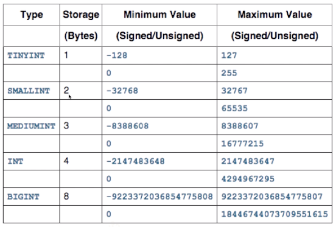
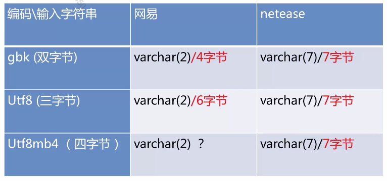
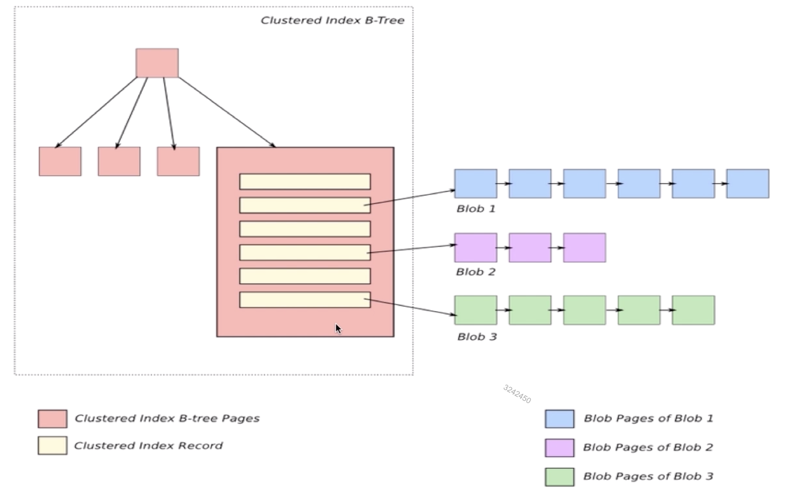
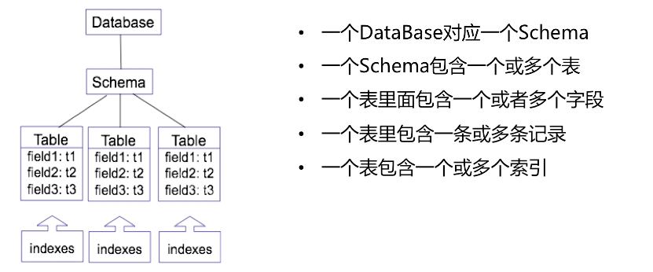
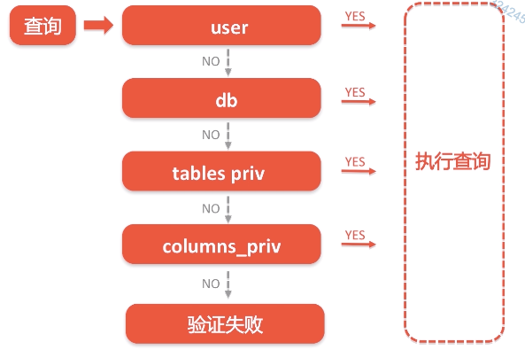

[TOC]


# 二、MySQL数据库对象与应用


## MySQL数据库对象


### 2.1 MySQL数据类型 (33min)

目标：

1. 学习掌握常用的数据类型；
2. 针对业务选择合适的数据类型


**整形：**




**浮点型：**


**DECIMAL:**

- 高精度的数据类型，常用来存储交易相关的数据
- `DECIMAL(M, N)` ：M代表总精度、N代表小数点
- 存储空间变长

**CHAR** 与 **VARCHAR** 与 **TEXT**

- **CHAR** 与 **VARCHAR** 存储的单位都是**字符**; **TEXT** 的存储单位为**字节**
- **CHAR** 类型最大为 255 字符；**VARCHAR** 可以存储超过 255 个字符；**TEXT** 总大小为 65535 字节, 约为64KB
- **CHAR** 存储定长，容易造成空间的浪费; **VARCHAR** 存储变长, 节省存储空间
- **TEXT** 在数据库内部大多存储格式为**溢出页**，效率不如 CHAR


```sql
mysql> CREATE TABLE t3(a char(256));
ERROR 1074 (42000): Column length too big for column 'a' (max = 255); use BLOB or TEXT instead

mysql> CREATE TABLE t4(a varchar(256));
Query OK, 0 rows affected (0.05 sec)
```


**BLOB** 与 **BINARY**


**时间**：DATE TIME DATETIME TIMESTAMP BIGINT

- 存储空间上的区别：
  - DATE 三字节；如 2015-05-01
  - TIME 三字节; 如 11:12:00
  - TIMESTAMP 四字节; 如 2015-05-01 11:12:00
  - DATETIME 八字节；如 2015-05-01 11:12:00
- 存储精度的区别：
  - DATE 精确到年月日
  - TIME 精确到小时分钟和秒
  - TIMESTAMP, DATETIME 都包含上述两者
- DATETIME 与 TIMESTAMP的区别
  - TIMESTAMP 存储范围：**1970**-01-01 00:00:01 to **2038**-01-19 03:14:07
  - DATETIME 存储范围：1000-01-01 00:00:00 to 9999-12-31 23:59:59
  - TIMESTAMP 会根据系统时区进行转换，DATETIME 则不会；(**国际系统推荐使用 TIMESTAMP**)

- BIGINT 可以存储时间戳，例子如下：

```shell
# 通过 python 拿到时间戳
$ python
Python 3.7.4 (default, Aug 13 2019, 15:17:50)
[Clang 4.0.1 (tags/RELEASE_401/final)] :: Anaconda, Inc. on darwin
Type "help", "copyright", "credits" or "license" for more information.
>>> import time
>>> time.time()
1613808278.173053
>>> exit()
(base)

# 通过命令行工具转换
$ sudo date -d 1613808278
Password:
2021年 2月20日 星期六 16时06分09秒 CST

# 通过 mysql from_unixtime 转换
mysql> SELECT from_unixtime(1613808278);
+---------------------------+
| from_unixtime(1613808278) |
+---------------------------+
| 2021-02-20 16:04:38       |
+---------------------------+
1 row in set (0.01 sec)

# 除了python, 通过 Mysql 也可以拿到时间戳
mysql> SELECT UNIX_TIMESTAMP(NOW());
+-----------------------+
| UNIX_TIMESTAMP(NOW()) |
+-----------------------+
|            1613808561 |
+-----------------------+
1 row in set (0.00 sec)
```

- DATETIME 与 TIMESTAMP的区别演示例子：

```sql
mysql> CREATE TABLE t5(a DATETIME, b TIMESTAMP);
Query OK, 0 rows affected (0.03 sec)

mysql> SHOW CREATE TABLE t5\G
*************************** 1. row ***************************
       Table: t5
Create Table: CREATE TABLE `t5` (
  `a` datetime DEFAULT NULL,
  `b` timestamp NOT NULL DEFAULT CURRENT_TIMESTAMP ON UPDATE CURRENT_TIMESTAMP
) ENGINE=InnoDB DEFAULT CHARSET=latin1
1 row in set (0.00 sec)

mysql> SELECT NOW();
+---------------------+
| NOW()               |
+---------------------+
| 2021-02-20 15:59:20 |
+---------------------+
1 row in set (0.00 sec)

mysql> INSERT INTO t5 VALUES(NOW(), NOW());
Query OK, 1 row affected (0.00 sec)

mysql> SELECT * FROM t5;
+---------------------+---------------------+
| a                   | b                   |
+---------------------+---------------------+
| 2021-02-20 15:59:35 | 2021-02-20 15:59:35 |
+---------------------+---------------------+
1 row in set (0.00 sec)
```

设置时间时区；会发现 b 自动往前8个小时:

```sql
mysql> SET time_zone = '+00:00';
Query OK, 0 rows affected (0.01 sec)

mysql> SELECT * FROM t5;
+---------------------+---------------------+
| a                   | b                   |
+---------------------+---------------------+
| 2021-02-20 15:59:35 | 2021-02-20 07:59:35 |
+---------------------+---------------------+
1 row in set (0.00 sec)

mysql> SET time_zone = '+08:00';
Query OK, 0 rows affected (0.00 sec)

mysql> SELECT * FROM t5;
+---------------------+---------------------+
| a                   | b                   |
+---------------------+---------------------+
| 2021-02-20 15:59:35 | 2021-02-20 15:59:35 |
+---------------------+---------------------+
1 row in set (0.00 sec)
```


---

问题1： **int(11) vs int(21) 的区别**？从存储空间和存储范围来解答.

- 在存储空间和存储范围上没有任何区别.
- 区别在于：如果存储数字1，int(11) 会在前面补10个0，int(21)会在前面补20个0

```sql
mysql> CREATE TABLE t(a int(11) zerofill, b int(21) zerofill);
Query OK, 0 rows affected (0.04 sec)

mysql> INSERT INTO t VALUES(1,1);
Query OK, 1 row affected (0.00 sec)

mysql> SELECT * FROM t;
+-------------+-----------------------+
| a           | b                     |
+-------------+-----------------------+
| 00000000001 | 000000000000000000001 |
+-------------+-----------------------+
1 row in set (0.00 sec)
```

```sql
mysql> CREATE TABLE t1(a int(11), b int(21));
Query OK, 0 rows affected (0.03 sec)

mysql> INSERT INTO t1 VALUES(1,1);
Query OK, 1 row affected (0.01 sec)


mysql> SELECT * FROM t1;
+------+------+
| a    | b    |
+------+------+
|    1 |    1 |
+------+------+
1 row in set (0.00 sec)
```


问题2：**浮点型会导致精度丢失**：不推荐存储敏感数据

```sql
mysql> CREATE TABLE t2(
    ->  `a` int(11) DEFAULT NULL,
    ->  `b` float(7,4) DEFAULT NULL
    -> ) ENGINE=InnoDB DEFAULT CHARSET=utf8;
Query OK, 0 rows affected (0.04 sec)

mysql> INSERT INTO t2 VALUES(2, 123.12345);
Query OK, 1 row affected (0.01 sec)

mysql> SELECT * FROM t2;
+------+----------+
| a    | b        |
+------+----------+
|    2 | 123.1235 |
+------+----------+
1 row in set (0.00 sec)
```


问题3：**性别、省份**信息如何选择数据类型？

- `tyntint` :  优先选择, 占1字节
- `char(1)`：M/W，1字节
- `enum` ：`enum('women', 'man')` 1字节


问题4：经验之谈

- 存储性别、省份、类别等分类信息时选择 `TINYINT` 或者 `ENUM`
- `BIGINT` 存储空间更大，`INT` 和 `BIGINT` 之间通常选择 `BIGINT`
- 交易等高精度数据时选择使用 `DECIMAL`
- `CHAR` 与 `VARCHAR` 定义的长度是字符长度而不是字节长度
- 存储字符选择推荐选择使用 `VARCHAR(N)`，N 尽量小
- 虽然数据库的 `BLOB` 和 `BINARY` 可以存储二进制数据，但是性能低下，不要使用数据库存储文件音频等二进制数据。
- `DATE` 和 `TIME` 类型精度较低
- `BIGINT` 类型一样也可以存储时间类型
- 数据类型选择，按需选择


问题5：**字符**与**字节**的区别?



- 答案是6字节
- 建议使用 `utf8mb4` 编码, 支持 emoji 表情


问题6：为什么 TEXT 的效率不如 CHAR，什么是溢出页？



### 2.2 MySQL 数据对象 (28min)

目标：学会如何创建具体的数据对象


**MySQL常见的数据对象有哪些?**

- DataBase/Schema
- Table
- Index
- View/Trigger/Function/Procedure


**库、表、行的层级关系**




**多 Database 用途**

- 业务的隔离
- 资源的隔离


**表上有哪些常用的数据对象？**

- 索引、约束、视图、触发器、函数、存储过程

- **索引 INDEX**：就是数据库中数据的目录
  - 索引和数据是两个对象
  - 索引主要是用来提高数据库的查询效率
  - 数据库中数据变更同样需要同步索引数据的变更
  - 如何创建索引： `help create index;` / `help alter table;`
- **约束 CONSTRINT**：
  - **唯一约束**：
    - 对一张表的某个字段或者某几个字段设置唯一约束，保证在这个表里对应的数据必须唯一。如用户ID，手机号，身份证号等。
    - 1）唯一约束是一种特殊的索引。 2）可以是一个或者多个字段。3）可以在建表的时候建好，也可以在后面补上。4）主键(PRIMARY KEY)也是一种唯一索引
    - 添加主键：`mysql> ALTER TABLE order ADD PRIMARY KEY(id);`
    - 添加唯一索引：`mysql> ALTER TABLE order ADD UNIQUE KEY idx_uk_orderid(orderid)`
  - **外键约束**：
    - 两张表的数据通过某种条件关联起来
    - 创建外键约束：**ADD CONSTRAINT**
      - 如将用户表user和订单表order通过外键关联起来 `mysql> ALTER TABLE order ADD CONSTRAINT constraint_uid FOREIGN KEY(userid) REFERENCES user(userid)`
    - 使用外键的注意事项：
      - 必须是 INNODB 表，Myisam 和其它引擎不支持外键
      - 相互约束的字段类型必须要一样
      - 主表的约束字段要求有索引
      - 约束的名称必须要唯一，即使不在同一张表上。
- **视图 VIEW **
  - 视图的作用？1）视图**由一组查询语句构成的结果集**，是一种虚拟结构，并不是实际数据。2）视图能**简化数据库的访问**，能够将多个查询语句结构化为一个虚拟结构。3）视图可以**隐藏数据库后端表结构**，提高数据库的安全性。4）视图也是一种**权限管理**，只对用户提供部分数据。
  - 举个例子，什么时候需要视图？当不想暴露表的结构，并且只提供部分数据出去的时候；可以通过视图提供这种能力
  - 创建视图，**CREATE VIEW**
    - 创建已完成订单的视图：`mysql> CREATE VIEW order_view AS SELECT * FROM order WHERE status=1;`
- **触发器 TRIGGER**
  - 什么是 TRIGGER? 指可以在数据写入表 A 之前/之后 可以做一些其它动作
  - 举个例子：系统需要根据用户的等级自动更新用户的积分，其中涉及两张表：用户信息表和积分表
- **函数 FUNCTION**
- **存储过程 PROCEDURE**


### 2.3 MySQL 权限管理 (27min)

目标：掌握MySQL赋权操作；MySQL权限验证流程


**登录网站需要什么信息？**

- 连接 mysql 的必要条件：

  - 1）网络要通畅 

  - 2）用户名和密码要正确

  - 3）数据库需要加IP和白名单

  - 4）更细粒度的验证(库、表、列权限类型等等)

    

**关于权限**

- 有哪些权限？`mysql> show privileges`
- 权限粒度
  - Data Privileges 数据层面上的权限:
    - **DATA**: SELECT, INSERT, UPDATE, DELETE
  - Definition Privileges 数据对象层面的权限：
    - **DataBase**: CREATE, ALTER, DROP
    - **Table**: CREATE, ALTER, DROP
    - **VIEW/FUNCTION/TRIGGER/PROCEDURE**: CREATE, ALTER, DROP
  - Administrator Privileges 管理权限:
    - Shutdown DataBase 
    - Replication Slave
    - Replication Client
    - File Privilege
- mysql 赋权操作：`help grant` ; 新建一个用户并赋权
  - 方法1：MySQL自带命令
    - 创建用户：`CREATE USER 'netease'@'localhost' IDENTIFIED BY 'netease163';`
    - 赋权：`GRANT SELECT ON *.* TO 'netease'@'localhost' WITH GRANT OPTION;`
  - 方法2：更改数据库记录
    - 首先向User表里面插入一条记录
    - 根据自己的需要选择是否向 `db` 和 `tables_priv` 表插入记录
    - 执行 `flush privileges` 命令，让权限信息生效
  - 方法3：**GRANT** 语句会判断是否存在该用户，如果不存在则新建
    - `GRANT SELECT ON *.* TO 'netease'@'localhost' IDENTIFIED BY 'netease163' WITH GRANT OPTION;`
- 查看用户权限
  - `SHOW GRANTS`
- 查看其它用户的权限
  - `SHOW GRANTS FOR netease@localhost`
- 回收不需要的权限
  - `REVOKE SELECT ON *.* FROM netease@localhost`
- 重新赋权
  - `GRANT INSERT ON *.* TO netease@localhost`
- 如何更改用户的密码
  - 用新密码，GRANT语句重新授权
  - 更改数据库记录，Update User 表的 Password 字段（不推荐）
    - 更改完需要 flush privileges 刷新权限信息
- 删除用户 `help drop user;`
  - 属于高危操作
- **WITH GRANT OPTION**
  - 允许被授予权利的人把权利授予给其他的人
- 权限管理的秘密
  - mysql **权限信息是存在数据库表中**
  - mysql 账号对应的密码也加密存储在数据库表中
  - 每一种权限类型在元数据里都是**枚举类型**，表明是否有该权限
  - mysql 的权限验证相比网站登录验证多了**白名单的环节**，并且粒度更细，可以精确到**表**和**字段**。
- 有哪些权限相关的表
  - user
  - db
  - tables_priv
  - columns_priv (最小的级别)



- mysql 权限上有哪些问题？
  - 使用 Binary 二进制安装管理用户没有设置密码
  - mysql 默认的test库不受权限控制，存在安全风险
  - 解决办法：mysql_secure_installation 工具
- 小结：
  - 权限相关的操作不要直接操作表，统一使用 mysql 命令。
  - 使用二进制安装 mysql 后，需要重置管理用户的密码
  - 线上数据库不要留 test 库
- 本节命令

```shell
1)show privileges;

2)help grant;

3)create user 'netease'@'localhost' indentified by 'netease163';

4)grant select on *.* to 'netease'@'localhost' whith grant option;

5)grant select on *.* to 'netease'@'localhost' indentified by 'netease163' whith grant option;

6)show grants;

7)show grants for netease@'localhost';

8)revoke select on *.* from netease@'localhost';

9)grant insert on *.* to netease@'localhost';

10)help drop user;

11)show create table mysql.user\G

12)select * from mysql.db where user='netease'\G

13)select * from mysql.tables_priv where user='netease'\G
```


### todo 实践课：数据对象(25min)

```sql
--

-- Table structure for table `tb_account`

--


DROP TABLE IF EXISTS `tb_account`;

/*!40101 SET @saved_cs_client     = @@character_set_client */;

/*!40101 SET character_set_client = utf8 */;

CREATE TABLE `tb_account` (

  `account_id` int(11) NOT NULL AUTO_INCREMENT,

  `nick_name` varchar(20) DEFAULT NULL,

  `true_name` varchar(20) DEFAULT NULL,

  `sex` char(1) DEFAULT NULL,

  `mail_address` varchar(50) DEFAULT NULL,

  `phone1` varchar(20) NOT NULL,

  `phone2` varchar(20) DEFAULT NULL,

  `password` varchar(30) NOT NULL,

  `create_time` datetime DEFAULT NULL,

  `account_state` tinyint(4) DEFAULT NULL,

  `last_login_time` datetime DEFAULT NULL,

  `last_login_ip` varchar(20) DEFAULT NULL,

  PRIMARY KEY (`account_id`)

) ENGINE=InnoDB DEFAULT CHARSET=utf8mb4;

/*!40101 SET character_set_client = @saved_cs_client */;


--

-- Table structure for table `tb_goods`

--


DROP TABLE IF EXISTS `tb_goods`;

/*!40101 SET @saved_cs_client     = @@character_set_client */;

/*!40101 SET character_set_client = utf8 */;

CREATE TABLE `tb_goods` (

  `goods_id` bigint(20) NOT NULL AUTO_INCREMENT,

  `goods_name` varchar(100) NOT NULL,

  `pic_url` varchar(500) NOT NULL,

  `store_quantity` int(11) NOT NULL,

  `goods_note` varchar(800) DEFAULT NULL,

  `producer` varchar(500) DEFAULT NULL,

  `category_id` int(11) NOT NULL,

  PRIMARY KEY (`goods_id`)

) ENGINE=InnoDB DEFAULT CHARSET=utf8mb4;

/*!40101 SET character_set_client = @saved_cs_client */;


--

-- Table structure for table `tb_goods_category`

--


DROP TABLE IF EXISTS `tb_goods_category`;

/*!40101 SET @saved_cs_client     = @@character_set_client */;

/*!40101 SET character_set_client = utf8 */;

CREATE TABLE `tb_goods_category` (

  `category_id` int(11) NOT NULL AUTO_INCREMENT,

  `category_level` smallint(6) NOT NULL,

  `category_name` varchar(500) DEFAULT NULL,

  `upper_category_id` int(11) NOT NULL,

  PRIMARY KEY (`category_id`)

) ENGINE=InnoDB DEFAULT CHARSET=utf8mb4;

/*!40101 SET character_set_client = @saved_cs_client */;


--

-- Table structure for table `tb_order`

--


DROP TABLE IF EXISTS `tb_order`;

/*!40101 SET @saved_cs_client     = @@character_set_client */;

/*!40101 SET character_set_client = utf8 */;

CREATE TABLE `tb_order` (

  `order_id` bigint(20) NOT NULL AUTO_INCREMENT,

  `account_id` int(11) NOT NULL,

  `create_time` datetime DEFAULT NULL,

  `order_amount` decimal(12,2) DEFAULT NULL,

  `order_state` tinyint(4) DEFAULT NULL,

  `update_time` datetime DEFAULT NULL,

  `order_ip` varchar(20) DEFAULT NULL,

  `pay_method` varchar(20) DEFAULT NULL,

  `user_notes` varchar(500) DEFAULT NULL,

  PRIMARY KEY (`order_id`)

) ENGINE=InnoDB DEFAULT CHARSET=utf8mb4;

/*!40101 SET character_set_client = @saved_cs_client */;


--

-- Table structure for table `tb_order_item`

--


DROP TABLE IF EXISTS `tb_order_item`;

/*!40101 SET @saved_cs_client     = @@character_set_client */;

/*!40101 SET character_set_client = utf8 */;

CREATE TABLE `tb_order_item` (

  `order_item_id` bigint(20) NOT NULL AUTO_INCREMENT,

  `order_id` bigint(20) NOT NULL,

  `goods_id` bigint(20) NOT NULL,

  `goods_quantity` int(11) NOT NULL,

  `goods_amount` decimal(12,2) DEFAULT NULL,

  PRIMARY KEY (`order_item_id`),

  UNIQUE KEY `uk_order_goods` (`order_id`,`goods_id`)

) ENGINE=InnoDB DEFAULT CHARSET=utf8mb4;

/*!40101 SET character_set_client = @saved_cs_client */;

/*!40103 SET TIME_ZONE=@OLD_TIME_ZONE */;


```


## MySQL进阶SQL应用


### todo 2.4 SQL 语言进阶 (40min)

```sql
-- ----------------------------
-- Table structure for `play_fav`
-- ----------------------------
DROP TABLE IF EXISTS `play_fav`;
CREATE TABLE `play_fav` (
  `userid` bigint(20) NOT NULL COMMENT '收藏用户id',
  `play_id` bigint(20) NOT NULL COMMENT '歌单id',
  `createtime` bigint(20) NOT NULL COMMENT '收藏时间',
  `status` int(11) DEFAULT '0' COMMENT '状态，是否删除',
  PRIMARY KEY (`play_id`,`userid`),
  KEY `IDX_USERID` (`userid`)
) ENGINE=InnoDB DEFAULT CHARSET=utf8 COMMENT='歌单收藏表';
 
-- ----------------------------
-- Records of play_fav
-- ----------------------------
INSERT INTO play_fav VALUES ('2', '0', '0', '0');
INSERT INTO play_fav VALUES ('116', '1', '1430223383', '0');
INSERT INTO play_fav VALUES ('143', '1', '0', '0');
INSERT INTO play_fav VALUES ('165', '2', '0', '0');
INSERT INTO play_fav VALUES ('170', '3', '0', '0');
INSERT INTO play_fav VALUES ('185', '3', '0', '0');
INSERT INTO play_fav VALUES ('170', '4', '0', '0');
INSERT INTO play_fav VALUES ('170', '5', '0', '0');
 
-- ----------------------------
-- Table structure for `play_list`
-- ----------------------------
DROP TABLE IF EXISTS `play_list`;
CREATE TABLE `play_list` (
  `id` bigint(20) NOT NULL COMMENT '主键',
  `play_name` varchar(255) DEFAULT NULL COMMENT '歌单名字',
  `userid` bigint(20) NOT NULL COMMENT '歌单作者账号id',
  `createtime` bigint(20) DEFAULT '0' COMMENT '歌单创建时间',
  `updatetime` bigint(20) DEFAULT '0' COMMENT '歌单更新时间',
  `bookedcount` bigint(20) DEFAULT '0' COMMENT '歌单订阅人数',
  `trackcount` int(11) DEFAULT '0' COMMENT '歌曲的数量',
  `status` int(11) DEFAULT '0' COMMENT '状态,是否删除',
  PRIMARY KEY (`id`),
  KEY `IDX_CreateTime` (`createtime`),
  KEY `IDX_UID_CTIME` (`userid`,`createtime`)
) ENGINE=InnoDB DEFAULT CHARSET=utf8 COMMENT='歌单';
 
-- ----------------------------
-- Records of play_list
-- ----------------------------
INSERT INTO play_list VALUES ('1', '老男孩', '1', '1430223383', '1430223383', '5', '6', '0');
INSERT INTO play_list VALUES ('2', '情歌王子', '3', '1430223384', '1430223384', '7', '3', '0');
INSERT INTO play_list VALUES ('3', '每日歌曲推荐', '5', '1430223385', '1430223385', '2', '4', '0');
INSERT INTO play_list VALUES ('4', '山河水', '2', '1430223386', '1430223386', '5', null, '0');
INSERT INTO play_list VALUES ('5', '李荣浩', '1', '1430223387', '1430223387', '1', '10', '0');
INSERT INTO play_list VALUES ('6', '情深深', '5', '1430223388', '1430223389', '0', '0', '1');
 
-- ----------------------------
-- Table structure for `song_list`
-- ----------------------------
DROP TABLE IF EXISTS `song_list`;
CREATE TABLE `song_list` (
  `id` bigint(20) NOT NULL COMMENT '主键',
  `song_name` varchar(255) NOT NULL COMMENT '歌曲名',
  `artist` varchar(255) NOT NULL COMMENT '艺术节',
  `createtime` bigint(20) DEFAULT '0' COMMENT '歌曲创建时间',
  `updatetime` bigint(20) DEFAULT '0' COMMENT '歌曲更新时间',
  `album` varchar(255) DEFAULT NULL COMMENT '专辑',
  `playcount` int(11) DEFAULT '0' COMMENT '点播次数',
  `status` int(11) DEFAULT '0' COMMENT '状态,是否删除',
  PRIMARY KEY (`id`),
  KEY `IDX_artist` (`artist`),
  KEY `IDX_album` (`album`)
) ENGINE=InnoDB DEFAULT CHARSET=utf8 COMMENT='歌曲列表';
 
-- ----------------------------
-- Records of song_list
-- ----------------------------
INSERT INTO song_list VALUES ('1', 'Good Lovin\' Gone Bad', 'Bad Company', '0', '0', 'Straight Shooter', '453', '0');
INSERT INTO song_list VALUES ('2', 'Weep No More', 'Bad Company', '0', '0', 'Straight Shooter', '280', '0');
INSERT INTO song_list VALUES ('3', 'Shooting Star', 'Bad Company', '0', '0', 'Straight Shooter', '530', '0');
INSERT INTO song_list VALUES ('4', '大象', '李志', '0', '0', '1701', '560', '0');
INSERT INTO song_list VALUES ('5', '定西', '李志', '0', '0', '1701', '1023', '0');
INSERT INTO song_list VALUES ('6', '红雪莲', '洪启', '0', '0', '红雪莲', '220', '0');
INSERT INTO song_list VALUES ('7', '风柜来的人', '李宗盛', '0', '0', '作品李宗盛', '566', '0');
 
-- ----------------------------
-- Table structure for `stu`
-- ----------------------------
DROP TABLE IF EXISTS `stu`;
CREATE TABLE `stu` (
  `id` int(10) NOT NULL DEFAULT '0',
  `name` varchar(20) DEFAULT NULL,
  `age` int(10) DEFAULT NULL,
  PRIMARY KEY (`id`)
) ENGINE=InnoDB DEFAULT CHARSET=latin1;
 
-- ----------------------------
-- Records of stu
-- ----------------------------
 
-- ----------------------------
-- Table structure for `tbl_proc_test`
-- ----------------------------
DROP TABLE IF EXISTS `tbl_proc_test`;
CREATE TABLE `tbl_proc_test` (
  `id` int(11) NOT NULL AUTO_INCREMENT,
  `num` int(11) DEFAULT NULL,
  PRIMARY KEY (`id`)
) ENGINE=InnoDB AUTO_INCREMENT=30 DEFAULT CHARSET=utf8;
 
-- ----------------------------
-- Records of tbl_proc_test
-- ----------------------------
INSERT INTO tbl_proc_test VALUES ('11', '1');
INSERT INTO tbl_proc_test VALUES ('12', '2');
INSERT INTO tbl_proc_test VALUES ('13', '6');
INSERT INTO tbl_proc_test VALUES ('14', '24');
INSERT INTO tbl_proc_test VALUES ('15', '120');
INSERT INTO tbl_proc_test VALUES ('16', '720');
INSERT INTO tbl_proc_test VALUES ('17', '5040');
INSERT INTO tbl_proc_test VALUES ('18', '40320');
INSERT INTO tbl_proc_test VALUES ('19', '362880');
INSERT INTO tbl_proc_test VALUES ('20', '3628800');
INSERT INTO tbl_proc_test VALUES ('21', '1');
INSERT INTO tbl_proc_test VALUES ('22', '2');
INSERT INTO tbl_proc_test VALUES ('23', '6');
INSERT INTO tbl_proc_test VALUES ('24', '24');
INSERT INTO tbl_proc_test VALUES ('25', '1');
INSERT INTO tbl_proc_test VALUES ('26', '2');
INSERT INTO tbl_proc_test VALUES ('27', '6');
INSERT INTO tbl_proc_test VALUES ('28', '24');
INSERT INTO tbl_proc_test VALUES ('29', '120');
 
-- ----------------------------
-- Table structure for `tbl_test1`
-- ----------------------------
DROP TABLE IF EXISTS `tbl_test1`;
CREATE TABLE `tbl_test1` (
  `user` varchar(255) NOT NULL COMMENT '主键',
  `key` varchar(255) NOT NULL,
  `value` varchar(255) NOT NULL,
  PRIMARY KEY (`user`,`key`)
) ENGINE=InnoDB DEFAULT CHARSET=utf8 COMMENT='行列转换测试';
 
-- ----------------------------
-- Records of tbl_test1
-- ----------------------------
INSERT INTO tbl_test1 VALUES ('li', 'age', '18');
INSERT INTO tbl_test1 VALUES ('li', 'dep', '2');
INSERT INTO tbl_test1 VALUES ('li', 'sex', 'male');
INSERT INTO tbl_test1 VALUES ('sun', 'age', '44');
INSERT INTO tbl_test1 VALUES ('sun', 'dep', '3');
INSERT INTO tbl_test1 VALUES ('sun', 'sex', 'female');
INSERT INTO tbl_test1 VALUES ('wang', 'age', '20');
INSERT INTO tbl_test1 VALUES ('wang', 'dep', '3');
INSERT INTO tbl_test1 VALUES ('wang', 'sex', 'male');
 
-- ----------------------------
-- Procedure structure for `proc_test1`
-- ----------------------------
DROP PROCEDURE IF EXISTS `proc_test1`;
DELIMITER ;;
CREATE DEFINER=`root` PROCEDURE `proc_test1`(IN total INT,OUT res INT)
BEGIN   
    DECLARE i INT;  
    SET i = 1; 
    SET res = 1; 
    IF total <= 0 THEN   
        SET total = 1;   
    END IF;   
    WHILE i <= total DO
        SET res = res * i;
        INSERT INTO tbl_proc_test(num) VALUES (res);  
        SET i = i + 1;
    END WHILE;
END
;;
DELIMITER ;
```


### todo 2.5 内置函数 (29min)

```sql
1)create table `song_list`(
`id` bigint(20) not null comment '主键',
`song_name` varchar(255) not null comment '歌曲名',
`artist` varchar(255) not null comment '艺术家',
`createtime` bigint(20) default '0' comment '歌曲创建时间',
`updatetime` bigint(20) default '0' comment '歌曲更新时间',
`album` varchar(255) default null comment '专辑',
`playcount` int(11) default '0' comment '点播次数',
`status` int(11) default '0' comment '状态，是否删除',
primary key(`id`),
key `IDX_artist`(`artist`),
key `IDX_album`(`album`)
)engine=innodb default charset=utf8 comment='歌曲列表';

2)select album, sum(playcount), avg(playcount) from song_list group by album;

3)select max(playcount), min(playcount) from song_list;

4)-- 错误查法
select song_name, max(playcount) from song_list;

-- 正确查法
select song_name, playcount from song_list order by playcount desc limit 1;

5)select count(*) from song_list;
select count(1) from song_list;
select count(song_name) from song_list;

6)select album, GROUP_CONCAT(song_name) from song_list group by album;

7)show global varibles like '%concat%';

8)select user,
max(case when 'key'='age' then value end) age,
max(case when 'key'='sex' then value end) sex,
max(case when 'key'='dep' then value end) dep,

from tbl_test1
group by user;

9)SELECT SUBSTRING('abcdef', 3);
-- 'cdef'
SELECT SUBSTRING('abcdef', -3);
-- 'def'
SELECT SUBSTRING('abcdef', 3, 2);
-- 'cd'
SELECT LOCATE('bar', 'foobarbar');
-- 4
SELECT LOCATE('xbar', 'foobar');
-- 0
SELECT LOCATE('bar', 'foobarbar', 5);
-- 7

10)select curdate();
select curtime();
select now();
select unix_timestamp();
select date_format('2009-10-24 22:23:00','%W %M %Y');
select date_format('2009-10-24 22:23:00','%H %i %s');

11)SELECT NOW() + INTERVAL 1 MONTH;
SELECT NOW() - INTERVAL 1 WEEK;

12)select rand();

13)select 1+ceil(rand()*4);

14)select * from play_list where (createtime between 1427791323 and 1430383307) and userid in (1,3,5);
```


### todo 2.6 触发器与存储过程(25min)

```sql
SET FOREIGN_KEY_CHECKS=0;
-- ----------------------------
-- Table structure for `stu`
-- ----------------------------
DROP TABLE IF EXISTS `stu`;
CREATE TABLE `stu` (
  `name` varchar(50) ,
  `course` varchar(50),
  `score` int(11),
  PRIMARY KEY (`name`)
) ENGINE=InnoDB ; 
 
 
delimiter // 
CREATE TRIGGER trg_upd_score 
BEFORE UPDATE ON `stu`
FOR EACH ROW 
BEGIN 
    IF NEW.score < 0 THEN 
        SET NEW.score = 0; 
    ELSEIF NEW.score > 100 THEN 
        SET NEW.score = 100; 
    END IF; 
END;// 
delimiter ; 
 
 
-- ----------------------------
-- Procedure structure for `proc_test1`
-- ----------------------------
DROP PROCEDURE IF EXISTS `proc_test1`;
DELIMITER ;;
CREATE   PROCEDURE `proc_test1`(IN total INT,OUT res INT)
BEGIN   
    DECLARE i INT;  
    SET i = 1; 
    SET res = 1; 
    IF total <= 0 THEN   
        SET total = 1;   
    END IF;   
    WHILE i <= total DO
        SET res = res * i;
        INSERT INTO tbl_proc_test(num) VALUES (res);  
        SET i = i + 1;
    END WHILE;
END
;;
DELIMITER ;
```

### todo 实践课：SQL进阶应用 (40min)

## MySQL程序开发


### todo 2.7 MySQL 字符集 (33min)

```sql
1)SHOW CHARACTER SET;

2)show collection;

3)CREATE DATABASE db_name CHARACTER SET latin1 COLLATE latin1_swedish_ci;

4)CREATE TABLE tbl1;

5)CREATE TABLE tbl1 (....) DEFAULT CHARSET=utf8 DEFAULT COLLATE=utf8_bin;

6)CREATE TABLE tbl1;

7)CREATE TABLE tbl1 (col1 VARCHAR(5) CHARACTER SET latin1 COLLATE latin1_german1_ci);

8)
-- 查看字符集
show [global] variables like 'character%';
show [global] variables like 'collation%';

-- 修改字符集
set global character_set_server=utf8; -- 全局
alter table xxx convert to character set xxx; -- 表

9)set names utf8;

10)create table `stu1`(
`name` varchar(50) not null default '',
`course` varchar(50) default null,
`score` int(11) default null,
primary key(`name`)
) engine=innodb default charset=latin1;

11)insert into stu1 values('pw','你好',44);(报错)

12)create table `stu2`(
`name` varchar(50) not null default '',
`course` varchar(50) default null,
`score` int(11) default null,
primary key(`name`)
) engine=innodb default charset=utf8;

13)回话连接设为utf8 & set names utf8;

14)insert into stu2 values('pw','你好',33);(正确)

15)select * from stu2;

16)set names gbk;

17)insert into stu2 values('pw2','你好吗',33);(报错)

18)insert into stu2 values('pw2','你好',33);(成功执行，存储错误)

19)set names utf8;

20)select * from stu2;

21)回话连接设为gbk & set names gbk;

22)insert into stu2 values('pw3','你好',33);(正确)

23)select * from stu2;

24)select length(course) from stu2;

25)create table `tb1`(

`name` varchar(50) not null,

) engine=innodb default charset=gbk;

26)
show global varibales like '%char%';
set character_set_database=gbk;
load data infile 'XXXX'（文件路径）;(文件编码是utf8)
select * from tb1;

27)
delete from tb1;
show varibales like '%char%';
set character_set_database=utf8;
load data infile 'XXXX'（文件路径）;(文件编码是utf8)
select * from tb1;
```


### todo 2.8 程序连接 MySQL (26min)

```java
import java.sql.*;
 
/**
 * 使用JDBC连接MySQL
 */
public class DBTest {
    public static Connection getConnection() throws SQLException, 
            java.lang.ClassNotFoundException {
        //第一步：加载MySQL的JDBC的驱动
        Class.forName("com.mysql.jdbc.Driver");
         
        //设置MySQL连接字符串,要访问的MySQL数据库 ip,端口,用户名,密码
        String url = "jdbc:mysql://localhost:3306/blog";        
        String username = "blog_user";
        String password = "blog_pwd";
         
        //第二步：创建与MySQL数据库的连接类的实例
        Connection con = DriverManager.getConnection(url, username, password);        
        return con;        
    }
     
    public static void main(String args[]) {
        Connection con = null;
        try {
            //第三步：获取连接类实例con，用con创建Statement对象类实例 sql_statement
            con = getConnection();            
            Statement sql_statement = con.createStatement();
             
            /************ 对数据库进行相关操作 ************/                
            //如果同名数据库存在，删除
            sql_statement.executeUpdate("drop table if exists user;");            
            //执行了一个sql语句生成了一个名为user的表
            sql_statement.executeUpdate("create table user (id int not null auto_increment," +
                    " name varchar(20) not null default 'name', age int not null default 0, primary key (id) ); ");
             
            //向表中插入数据
            System.out.println("JDBC 插入操作:");
            String sql = "insert into user(name,age) values('liming', 18)";
             
            int num = sql_statement.executeUpdate("insert into user(name,age) values('liming', 18)");
            System.out.println("execute sql : " + sql);
            System.out.println(num + " rows has changed!");
            System.out.println("");
             
            //第四步：执行查询，用ResultSet类的对象，返回查询的结果
            String query = "select * from user";            
            ResultSet result = sql_statement.executeQuery(query);
             
            /************ 对数据库进行相关操作 ************/
            System.out.println("JDBC 查询操作:");
            System.out.println("------------------------");
            System.out.println("userid" + " " + "name" + " " + "age ");
            System.out.println("------------------------");
             
            //对获得的查询结果进行处理，对Result类的对象进行操作
            while (result.next()) {
                int userid =   result.getInt("id");
                String name    =   result.getString("name");
                int age        =   result.getInt("age");
                //取得数据库中的数据
                System.out.println(" " + userid + " " + name + " " + age);                
            }
             
            //关闭 result,sql_statement
            result.close();
            sql_statement.close();
             
            //使用PreparedStatement更新记录
            sql = "update user set age=? where name=?;"; 
            PreparedStatement pstmt = con.prepareStatement(sql); 
             
            //设置绑定变量的值
            pstmt.setInt(1, 15); 
            pstmt.setString(2, "liming"); 
             
            //执行操作
            num = pstmt.executeUpdate(); 
             
            System.out.println("");
            System.out.println("JDBC 更新操作:");
            System.out.println("execute sql : " + sql);
            System.out.println(num + " rows has changed!");
             
            //关闭PreparedStatement
            pstmt.close();
             
            //流式读取result，row-by-row
            query = "select * from user";            
            PreparedStatement ps = (PreparedStatement) con.prepareStatement
            (query,ResultSet.TYPE_FORWARD_ONLY, ResultSet.CONCUR_READ_ONLY);  
             
            ps.setFetchSize(Integer.MIN_VALUE);  
             
            result = ps.executeQuery();  
             
            /************ 对数据库进行相关操作 ************/
            System.out.println("JDBC 查询操作:");
            System.out.println("------------------------");
            System.out.println("userid" + " " + "name" + " " + "age ");
            System.out.println("------------------------");
             
            //对获得的查询结果进行处理，对Result类的对象进行操作
            while (result.next()) {
                int userid = result.getInt("id");
                String name = result.getString("name");
                int age = result.getInt("age");
                //取得数据库中的数据
                System.out.println(" " + userid + " " + name + " " + age);                
            }
             
            //关闭 result,ps
            result.close();
            ps.close();
            con.close();
        } catch(java.lang.ClassNotFoundException e) {
            //加载JDBC错误,所要用的驱动没有找到
            System.err.print("ClassNotFoundException");
            //其他错误
            System.err.println(e.getMessage());
        } catch (SQLException ex) {
            //显示数据库连接错误或查询错误
            System.err.println("SQLException: " + ex.getMessage());
        }
    }
}
```


### todo 2.9 DAO 框架的使用 (32min)


## 测验&考试