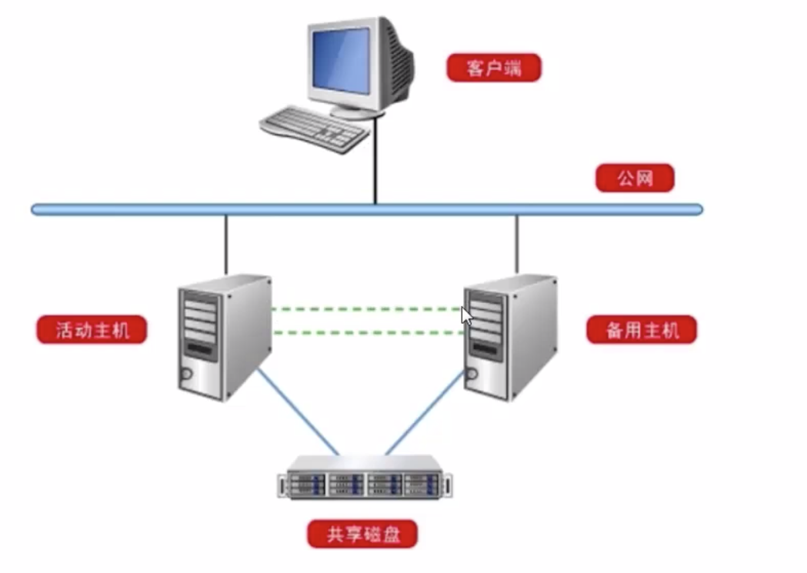

[toc]

# [MySQL高级架构技术](https://mooc.study.163.com/course/2001157000?tid=2001223007)

## 一、高可用架构

### 1.1 高可用概述 (11min)

#### 1.1.1 高可用 (High Availability)

- 应用提供持续不间断(可用)的服务的能力
- 系统高可用的评价通常用可用率来表示
  - 实际上，**99%** 可用率是很糟糕的指标

#### 1.1.2 造成不可用的原因

- 硬件故障
- 预期中的系统软硬件维护
- 软件缺陷(应用代码、服务程序都可能存在bug...)
- 攻击、泄露、人为失误...等安全事件
- 对于系统来说，不可用时间是各关键组件不可用时间的总和

#### 1.1.3 提高可用性的主要手段

- 冗余， Redundancy
- 关键软硬件通过备用冗余避免故障时长时间的不可用
- 数据**软件**、**硬件**、**存储的数据**，都需要通过冗余确保故障时可替换

### 1.2 高可用常见方案 (28min)

#### 1.2.1 数据库冗余与可用性

- 数据库服务在冗余实现上有其**特殊性**
  - 数据：**服务**“有状态”与**数据**冗余
- 实现方式多种多样，**同一种数据也会有多种实现方案**
- 可用性目标循序渐进：
  - **任何故障**都不会造成数据丢失 -> 可以**较快速恢复**服务(高可用)

#### 1.2.2 基于共享存储的单活方案(比较扯) 

04 min

- 稳健、可靠
- SAN共享存储这套方案比较昂贵；

#### 1.2.3 基于存储复制的数据冗余单活(不常用)

#### 1.2.4 基于 mysql 主从复制 (常用、普适)

- 主库可读可写，备库只读；降低了浪费

##### 1.2.4.1 主从复制高可用方案需要改进的问题

- **主从服务器各自有IP地址**，发生主从切换后应用需要修改重启
- 人工判断主库是否故障再发起切换需要花较多时间
- 主从复制存在客观**延迟**，切换后可能造成**事务数据丢失**

##### 1.2.4.2 方案改进：Virtual IP(VIP)飘移方案

为了避免应用人工修改切换IP，引入Virtual IP飘移方案

- 应用服务器访问Virtual IP

主库发生故障后

- 如果主库还存活，注销主库的 virtual ip, 把从库的 virtual ip 注册上
- 如果主库不存活，直接注册从库的 virtual ip

##### 1.2.4.3 方案改进：通过DNS解析域名来切换IP

- 主从IP虽然不一样，但主从服务器可以挂同一个域名，正常情况下挂在主服务器的IP上，当主服务器出问题后，通过DNS操作把域名从主库上注销掉，注册到从库的ip上。
- 应用程序报了个错，然后重新解析这个域名，解析出来的新地址是从库上的ip地址

##### 1.2.4.4 方案改进：自动探活处理机制

- 为了减少人工介入处理的时间开销引入自动探活处理机制
- 通过监控服务器来完成，监控后端数据库服务是否正常，一旦发生故障就去完成主从切换和VIP飘移；代替人工介入

##### 1.2.4.5  高可用中间层与RDS

- VIP 解决应用切换问题
- 监控和管理服务器解决自动判断故障切换和VIP飘移
- VIP管理+探活+主从关系切换=高可用中间层
- 云环境+高可用中间层+底层数据库=一种PaaS=基本RDS

##### 1.2.4.6 高可用中间层

- MHA (线上比较推崇这种方案)
  - 自动选择复制延迟最小的从节点并试图补全日志（但大部分主机故障情况下行不通）
  - 通常要求两从以上，会进行主从关系切换
  - 不提供VIP管理方案
- MMM
  - 提供了基本的VIP管理方案
  - 适合双主配置的一对主机，不会主动切换主从关系
  - 不支持主从数据延迟判断和补全

##### 1.2.4.7 方案改进：MySQL半同步

**主从复制延迟**

- 日志传输延迟，日志传输到从库有延迟，可能造成主从日志不一致

- unsent 的时间不确定

**MySQL 半同步方案**

- 主库的commit要等待从库也完成
- 风险1：造成性能损耗 

- 风险2：从库如果发生故障怎么办？

##### 1.2.4.8 较完善的mysql高可用方案

- 半同步复制 + 高可用中间层 + VIP 管理方案

例如：

- 半同步复制 + MHA + Keepalive
- 半同步复制  + RDS

#### 1.2.5 基于集群提高通信协议的多主复制 (一定场景适用)

- 所有的数据库都能读写

### 1.3 高可用框架MHA (30min)

#### 1.3.1 MHA

- 用一个管理节点监控后端数据库主库可用性
- 提供VIP飘移接口，不提供具体方法
- 提供补全从库日志的脚本

#### todo 1.3.2 MHA 的安装步骤

### 1.4 单元测验

## 二、读写分离

### 2.1 读写分离概述 (9min)

#### 2.1.1 What

#### 2.1.2 Why

1. 提升数据库查询的扩展性；**尤其是只读的业务远远多于写的业务**

2. **保护主库**：避免被复杂的查询逻辑搞垮，这部分可以放到从库上去完成

3. **提升资源利用**：利用从库的资源

#### 2.1.3 How

1. **应用端读写分离**

2. **服务器端读写分离** （常用）

#### 2.1.4 主要问题

1. 数据可能不一致
2. 部署、实现相对复杂

### 2.2 读写分离常见方案(38min)

#### 2.2.1 读写分离方案介绍

##### **2.2.1.1 MySQL Proxy**

官方版本：

360 版本：

##### **2.2.1.2 Amoeba For MySQL (不推荐)** 

##### **2.2.1.3 MySQL Router**

##### **2.2.1.4 应用端实现**

#### todo 2.2.2 mysql Proxy (Atlas) 部署 (08:)

### 2.3 单元测验

## 三、分布式架构

### 3.1 分布式架构

目标：常见的分布式数据库架构、mysql分布式架构

分布式数据库

- 区别单机，不因单台服务器的性能瓶颈上限
- 一般由管理节点、计算节点、数据节点组成
- 数据节点统一由分布式数据库管理节点控制

分布式数据的分类

- Shared Nothing vs Shared Anything

- Shared Nothing
  - MySQL Cluster 官方提供，支持数据分片

### 3.2 开源分布式软件MyCat

### 3.3 单元测验

## 四、新发展

### 4.1 新版本特性介绍

### 4.2 单元测验

